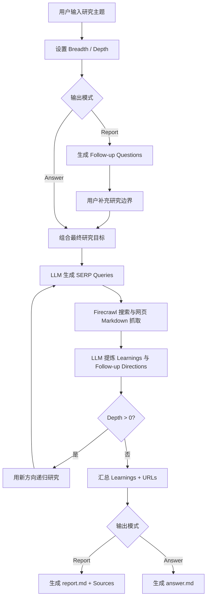

# Open Deep Research（MAAS 兼容版）— 项目能力说明

> **用途**：作为项目知识源、项目介绍、AI Worker/数字员工能力定义或后续方案设计的基线文档。  
> **代码库**：`https://github.com/Gumb-D/deep-research`  
> **部署基线**：fork 的 `main` 分支已包含 MAAS Prompt-JSON compatibility。  
> **已知基线版本**：`a7f1687`（README 将 `main` 设为默认 MAAS 部署路径）。

---

## 1. 项目定位

Open Deep Research 是一个以 **LLM + Web Search + 网页内容提取** 为核心的递归式研究代理（Deep Research Agent）。

它不是传统关键词搜索工具，而是将一个研究主题拆解为多轮研究任务：

1. 接收用户研究主题、研究广度（breadth）和深度（depth）。
2. 在报告模式下先提出澄清问题，补充研究边界。
3. 由 LLM 生成多条 SERP 搜索查询。
4. 调用 Firecrawl 搜索并抓取网页 Markdown 内容。
5. 从网页内容中提炼事实、关键结论、数字、实体和下一步研究问题。
6. 依据 follow-up directions 递归展开下一层研究。
7. 汇总 learnings、访问 URL 和最终报告/答案。

适合用于：
- 行业研究、市场调研、竞品研究
- 技术选型与产品能力梳理
- 供应商、方案、政策、标准、趋势的公开资料调研
- 电信项目交付自动化、MW/IPRAN/RAN、网络运维、AI Agent 等课题研究
- 为后续决策、方案设计、内部汇报提供研究初稿和来源清单

---

## 2. 核心能力总览

| 能力域 | 能力说明 | 当前实现状态 |
|---|---|---|
| 交互式研究规划 | 在 `report` 模式下生成 follow-up questions，收集用户回答后重组研究目标 | 已实现 |
| 多轮搜索策略 | 根据研究主题及前序 learnings 自动生成多条差异化 SERP 查询 | 已实现 |
| 网页搜索与抓取 | 通过 Firecrawl 搜索网页并提取 Markdown 内容 | 已实现 |
| 信息提炼 | 从抓取内容中提取信息密集型 learnings、实体、数据点和后续研究问题 | 已实现 |
| 递归深度研究 | 按 breadth / depth 递归生成新的研究方向并继续搜索 | 已实现 |
| 并发控制 | 限制并发研究任务，降低 API rate-limit 风险 | 已实现 |
| 去重汇总 | 对 learnings 与 visited URLs 进行去重汇总 | 已实现 |
| 长报告生成 | 汇总 learnings，生成 Markdown 长报告，并附来源 URL 列表 | 已实现 |
| 精确答案生成 | 对适合短答案的问题生成 `answer.md` | 已实现 |
| CLI 运行方式 | 交互式命令行问答与报告生成 | 已实现 |
| HTTP API 基础入口 | 提供 `/api/research` 与 `/api/generate-report` 路由代码 | 已实现，但生产化前需单独验证 |
| 自定义模型端点 | 支持 OpenAI-compatible endpoint 与自定义模型名称 | 已实现 |
| MAAS 结构化输出兼容 | 适配不正确支持 `response_format: json_schema` 的 MAAS gateway | 已实现 |
| 私有网络访问 | 可通过 Tailscale/MagicDNS 访问内部 `.ts.net` MAAS endpoint | 已验证于当前部署模式 |

---

## 3. 端到端工作流



---

## 4. 输入、控制参数与输出

### 4.1 用户输入

| 输入项 | 说明 |
|---|---|
| Research Query | 需要研究的问题、主题或业务场景 |
| Breadth | 每一轮大约生成多少条研究查询；越高，覆盖面越广、API 消耗越高 |
| Depth | 递归研究层数；越高，研究链路越深、耗时与成本越高 |
| Output Mode | `report` 生成长报告；`answer` 生成短答案 |
| Follow-up Answers | 仅 `report` 模式：用户回答系统提出的澄清问题，帮助明确边界、对象、地域、时间范围和交付期待 |

### 4.2 关键运行参数

| 环境变量 | 作用 | 默认/建议 |
|---|---|---|
| `FIRECRAWL_KEY` | Firecrawl 搜索与网页提取认证 | 必填 |
| `FIRECRAWL_BASE_URL` | 自建 Firecrawl endpoint | 可选 |
| `FIRECRAWL_CONCURRENCY` | Firecrawl 并发数 | 默认 2；受限套餐建议 1 |
| `OPENAI_KEY` | OpenAI-compatible endpoint API key | 视模型端点而定 |
| `OPENAI_ENDPOINT` | 自定义 OpenAI-compatible endpoint | 可选 |
| `CUSTOM_MODEL` | 自定义模型名称/alias | 可选 |
| `MAAS_PROMPT_JSON` | 启用 MAAS Prompt-JSON compatibility | MAAS 部署必设为 `"true"` |
| `MAAS_JSON_MAX_TOKENS` | 中间结构化任务最大 token | 默认 4096 |
| `MAAS_REPORT_MAX_TOKENS` | 最终报告最大 token | 默认 16000 |
| `MAAS_JSON_RETRIES` | 中间 JSON 输出最大额外重试次数 | 默认 2，最高 5 |

### 4.3 输出文件

| 模式 | 输出文件 | 内容 |
|---|---|---|
| `report` | `report.md` | 综合研究报告、关键 learnings、来源 URL 清单 |
| `answer` | `answer.md` | 针对用户问题的短答案 |

---

## 5. 研究引擎能力细节

### 5.1 搜索查询自动拆解

系统会根据用户目标自动生成多个 SERP query。每个查询包含：

- `query`：实际搜索关键字
- `researchGoal`：该查询要完成的研究目标，以及结果回来后应如何继续深入

这使系统能够从同一主题下拆分不同维度，例如：

- 市场与竞争格局
- 技术架构与实现路径
- 成本、ROI 和部署条件
- 风险、合规与安全要求
- 已落地案例与最佳实践

### 5.2 网页内容提炼

对每条搜索查询，系统会：

1. 从 Firecrawl 搜索结果中最多获取 5 个网页结果。
2. 提取网页 Markdown 内容。
3. 对每篇内容进行 prompt trimming，避免上下文过长。
4. 要求模型输出：
   - 关键 learnings
   - 后续 follow-up research questions

提炼要求强调：

- 结论必须尽量信息密集、具体而不重复。
- 应保留公司、产品、人物、地点、日期、数值、指标等实体信息。
- 输出应可作为下一轮研究的上下文。

### 5.3 递归研究

每一轮研究后，系统会将：

- 上一轮 research goal
- 新生成的 follow-up research directions
- 已累计 learnings
- 已访问 URLs

组合成下一层研究目标，并在 depth 未耗尽时继续运行。

递归时会将下一层 breadth 缩减为上一层约一半，避免搜索树无控制扩张。

### 5.4 并发与容错

- 通过 `p-limit` 控制并行搜索/处理任务。
- 单条 Firecrawl 搜索设置超时控制。
- 单条查询失败或超时时，该查询返回空结果，不会立即中止整次研究。
- 最终会对 learnings 和 URLs 去重。

---

## 6. MAAS Prompt-JSON Compatibility 能力

### 6.1 要解决的问题

上游实现依赖原生 OpenAI Structured Outputs：

```text
generateObject()
+ response_format: json_schema
```

部分 MAAS / OpenAI-compatible gateway 虽然接受请求，但不会正确透传或强制执行 `response_format: json_schema`。典型结果包括：

```text
NoObjectGeneratedError
JSON parsing failed
```

或模型返回普通自然语言、推理文本、截断 JSON，而不是符合 schema 的对象。

### 6.2 本 fork 的兼容机制

当以下配置启用时：

```env
MAAS_PROMPT_JSON="true"
```

系统对中间结构化任务改用：

```text
generateText()
→ 在 System Prompt 中要求仅返回 JSON
→ 在 Prompt 中嵌入 JSON contract
→ 提取 JSON object
→ JSON.parse
→ Zod schema validation
→ 检查 finishReason 必须为 stop
→ 失败时 bounded retry
```

该兼容路径覆盖：

- Follow-up question generation
- SERP query generation
- SERP result processing / learning extraction

最终长报告与短答案则使用文本生成，并检查模型是否以 `finishReason = stop` 正常完成。

### 6.3 兼容模式边界

- `MAAS_PROMPT_JSON` 未设为 `"true"` 时，保留原生 `generateObject()` 行为。
- 该能力解决的是 **模型输出结构化格式兼容**，不替代模型质量评估。
- 若 gateway 返回的实际模型名称与请求 alias 不一致，应由 MAAS owner 确认路由、成本归属、SLA 和输出质量标准。

---

## 7. 运行方式

### 7.1 CLI 模式

```powershell
npm start
```

CLI 会依次询问：

1. 研究主题
2. Breadth
3. Depth
4. 输出模式：`report` 或 `answer`
5. 若为 report：多个 follow-up questions 的回答

适合：
- 人工参与的高质量专题研究
- 研究目标需要逐步澄清的任务
- 先以小规模参数验证模型、网络、Firecrawl 额度的场景

### 7.2 API 模式

项目中包含 Express API 入口：

```powershell
npm run api
```

设计中的主要路由：

| 路由 | 预期用途 |
|---|---|
| `POST /api/research` | 执行研究并返回短答案、learnings 与 visited URLs |
| `POST /api/generate-report` | 执行研究并生成报告 |

> **注意**：API 层目前属于基础实现。用于团队/生产场景前，应补齐鉴权、请求校验、异步任务队列、超时控制、结果存储、可观测性、配额控制与错误处理测试。

---

## 8. 已验证能力与未验证边界

### 8.1 已验证

| 验证项 | 状态 |
|---|---|
| Tailscale 私网连通性与 MagicDNS 使用模式 | 已验证 |
| MAAS endpoint authentication | 已验证 |
| Prompt-constrained JSON 输出 | 已验证 |
| MAAS compatibility helper 的 TypeScript 检查 | 已通过 |
| MAAS compatibility helper 单元测试 | 已通过 |
| `report` 模式越过“Creating research plan...”并生成 follow-up questions | 已验证 |
| 默认 `main` 分支包含 MAAS compatibility 与部署说明 | 已完成 |

### 8.2 仍应在目标环境验证

| 项目 | 原因 |
|---|---|
| 完整 report 从搜索到 `report.md` 的端到端成功率 | 受 Firecrawl 额度、网页可访问性、模型路由与 token 限制影响 |
| API 路由在生产使用下的稳定性 | 当前 API 层未完成生产化治理 |
| 长报告 token 上限与模型截断风险 | 不同 MAAS routing/model 的 reasoning 与输出 token 行为可能不同 |
| 检索来源质量与引用可信度 | 当前流程会列出 URLs，但不等同于自动事实核验或权威来源评级 |
| 模型 alias 与实际模型一致性 | Gateway 可能对模型进行 alias/fallback/routing |

---

## 9. 适用场景

### 高适配场景

- 需要快速建立主题研究初稿和来源列表
- 需要把宽泛问题分解为多个研究方向
- 需要追踪公开网页中的技术、市场、产品、政策或案例
- 需要以 breadth/depth 控制调研规模
- 需要先产出 research brief，再进入人工复核、方案设计或报告撰写

### 电信项目交付可用场景

| 场景 | 可研究的问题示例 |
|---|---|
| MW rollout | 厂商 MW rollout 自动化能力、站点交付风险、ATP/PAC 最佳实践 |
| IPRAN / RAN integration | 集成流程自动化、跨域依赖、参数/资源协同方式 |
| Material & site readiness | 物料追踪、站点 readiness、异常预警、物流与施工协调机制 |
| Acceptance governance | RFS、ATP、PAC、FAC 的流程控制点、常见争议、证据要求 |
| AI Agent 选型 | 项目交付 Agent、workflow automation、RAG/knowledge base、LLM 编排方案 |
| 供应商与市场研究 | 产品能力、合作模式、真实案例、部署前提、风险与成本信息 |

---

## 10. 不应把它误认为的能力

该项目当前**不是**以下系统：

- 不是企业级知识库/RAG 平台
- 不是长期记忆或客户档案系统
- 不是项目管理系统（没有 WBS、责任人、计划基线、审批流）
- 不是自动化执行平台（默认不执行登录、下单、配置变更或外部写操作）
- 不是事实保证系统（输出须由人审查，尤其是关键决策、合同、法规、财务与网络变更）
- 不是生产级多租户 SaaS（缺少认证、权限、审计、队列、数据隔离与成本治理）
- 不是企业内部数据分析器（除非后续另行增加私有数据接入、权限与脱敏能力）

---

## 11. 主要限制与风险

| 风险/限制 | 说明 | 建议控制 |
|---|---|---|
| 搜索成本与额度 | Breadth、Depth 增大将提高 Firecrawl 与模型调用量 | 首次从 breadth=1、depth=1 开始 |
| 来源质量不稳定 | 搜索网页可能包含过时、营销或低可信来源 | 对关键结论进行人工复核与来源分级 |
| 模型幻觉 | LLM 对网页内容的归纳可能产生误读或遗漏 | 保留 URL、抽样回查原文、建立事实核验步骤 |
| 长输出截断 | 推理模型/网关可能因 token 或响应限制中止 | 调整 token 参数，必要时拆分报告 |
| MAAS gateway 差异 | 结构化输出、finish reason、model routing 行为可能不同 | 保留兼容模式与环境级 smoke test |
| 私网依赖 | 内部 MAAS endpoint 依赖 Tailscale/DNS/ACL | 上线前做 DNS、TLS、443 和权限验证 |
| 无数据治理 | 当前不含 PII 脱敏、数据分级、审计与保留策略 | 企业使用前补充安全与治理层 |
| 无任务持久化 | 长任务断开、进程退出后无法自动恢复 | 后续引入队列、任务状态库、checkpoint |

---

## 12. 推荐使用方式

### 12.1 首次部署验收

1. 安装 Git、Node.js 22（建议 `fnm`）和 Tailscale。
2. Clone 本 fork 的 `main`：
   ```powershell
   git clone https://github.com/Gumb-D/deep-research.git
   Set-Location deep-research
   ```
3. 执行：
   ```powershell
   fnm install 22
   fnm use 22
   npm ci
   Copy-Item .env.example .env.local
   ```
4. 配置 Firecrawl、MAAS endpoint 与 API key。
5. 启用：
   ```env
   MAAS_PROMPT_JSON="true"
   ```
6. 验证 Tailscale DNS/MagicDNS、endpoint DNS 与 TCP 443。
7. 运行：
   ```powershell
   npm start
   ```
8. 首次只使用：
   ```text
   breadth = 1
   depth = 1
   ```
9. 确认已成功到达 research-plan / follow-up question 阶段，再逐步提升规模。

### 12.2 日常更新

```powershell
git pull origin main
npm ci
```

更新前如本地有未提交工作，应先提交、stash 或清理，避免覆盖本地修改。

---

## 13. 后续演进建议

按价值与风险排序：

1. **完成端到端验收**
   - 固定一个小型测试主题。
   - 保存成功与失败日志、token、耗时、Firecrawl 调用量。
   - 验证 `report.md`、来源清单与结论质量。

2. **增加运行治理**
   - 记录 requested model 与 returned model。
   - 增加调用次数、token、耗时、失败类型、重试次数日志。
   - 配置单次研究的预算与最大 breadth/depth 上限。

3. **生产化 API**
   - API key/JWT 鉴权
   - 任务队列与异步状态查询
   - 超时、重试、取消与 checkpoint
   - 结果持久化与下载
   - 审计日志与使用配额

4. **提升研究质量**
   - 来源可信度分级
   - 去重与时间过滤
   - 关键事实逐条引用
   - 人工 review gate
   - 输出模板：市场研究、技术选型、项目风险、供应商比较、RFP 支持

5. **连接企业知识与工作流**
   - 接入内部文档/RAG
   - 接入项目台账、站点数据、PR、PO、AA、RFS/ATP/PAC 状态
   - 把“研究 agent”扩展为“Research → Recommendation → Draft Action → Human Approval”的闭环

---

## 14. 项目能力一句话描述

> 一个可配置研究广度与深度的 LLM 驱动 Web Research Agent：自动生成搜索策略、抓取网页、提炼结论、递归追问并输出附来源的 Markdown 研究报告；本 fork 已增加对 MAAS/OpenAI-compatible gateway 非原生 JSON Schema 行为的兼容能力。

