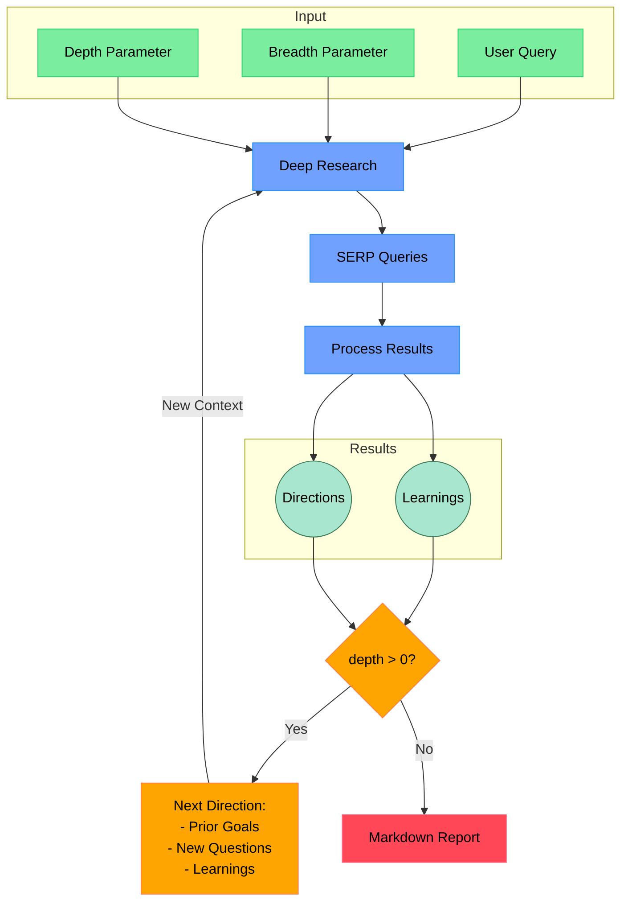

# Open Deep Research

An AI-powered research assistant that performs iterative, deep research on any topic by combining search engines, web scraping, and large language models.

The goal of this repo is to provide the simplest implementation of a deep research agent - e.g. an agent that can refine its research direction over time and deep dive into a topic. Goal is to keep the repo size at <500 LoC so it is easy to understand and build on top of.

If you like this project, please consider starring it and giving me a follow on [X/Twitter](https://x.com/dzhng). This project is created by [Duet](https://duet.so).

## How It Works



## Features

- **Iterative Research**: Performs deep research by iteratively generating search queries, processing results, and diving deeper based on findings
- **Intelligent Query Generation**: Uses LLMs to generate targeted search queries based on research goals and previous findings
- **Depth & Breadth Control**: Configurable parameters to control how wide (breadth) and deep (depth) the research goes
- **Smart Follow-up**: Generates follow-up questions to better understand research needs
- **Comprehensive Reports**: Produces detailed markdown reports with findings and sources
- **Concurrent Processing**: Handles multiple searches and result processing in parallel for efficiency

## Requirements

- Node.js environment
- API keys for:
  - Firecrawl API (for web search and content extraction)
  - OpenAI API (for o3 mini model)

## Setup

### Node.js

1. Clone the repository
2. Install dependencies:

```bash
npm install
```

3. Set up environment variables in a `.env.local` file:

```bash
FIRECRAWL_KEY="your_firecrawl_key"
# If you want to use your self-hosted Firecrawl, add the following below:
# FIRECRAWL_BASE_URL="http://localhost:3002"

OPENAI_KEY="your_openai_key"
```

To use local LLM, comment out `OPENAI_KEY` and instead uncomment `OPENAI_ENDPOINT` and `OPENAI_MODEL`:

- Set `OPENAI_ENDPOINT` to the address of your local server (eg."http://localhost:1234/v1")
- Set `OPENAI_MODEL` to the name of the model loaded in your local server.

## Deploying the MAAS-Compatible Fork on Another Windows Machine

This fork can run against a MAAS-provided OpenAI-compatible endpoint on another Windows machine without changing the default upstream behavior for other users.

### Requirements

The target machine must have:

- Git
- Node.js 22 installed via `fnm`
- Tailscale installed and logged into the correct tailnet
- Tailscale DNS / MagicDNS enabled so the internal `.ts.net` MAAS endpoint resolves

### Clone the fork and switch to the compatibility branch

```powershell
git clone https://github.com/Gumb-D/deep-research.git
Set-Location deep-research
git checkout maas-compat
```

### Install the pinned Node version and dependencies

```powershell
fnm install 22
fnm use 22
npm ci
```

The repository includes a `.node-version` file to pin the expected Node runtime for this fork.

### Configure the environment

```powershell
Copy-Item .env.example .env.local
```

Then update `.env.local` with your approved MAAS endpoint and API key. Do not commit `.env.local`, API keys, or any other secrets to source control.

Add this required setting:

```env
MAAS_PROMPT_JSON="true"
```

### Why MAAS mode is required

Some MAAS/OpenAI-compatible gateways do not enforce native `response_format: json_schema`. This fork adds a compatibility mode that uses prompt-constrained JSON, local validation, and bounded retries for the intermediate structured steps.

Default upstream behavior remains unchanged unless `MAAS_PROMPT_JSON="true"` is explicitly enabled.

### What this fork fixes

#### Private MAAS endpoint connectivity

A private MAAS endpoint exposed through Tailscale can fail with:

```text
ENOTFOUND <host>.ts.net
```

Usual causes are Tailscale not being connected, the machine being logged into the wrong tailnet, or Tailscale DNS / MagicDNS being disabled.

Required checks:

- Tailscale is installed and logged in
- the machine belongs to the correct tailnet
- the `.ts.net` hostname resolves
- the MAAS endpoint is reachable over HTTPS/TCP 443

Do not place real internal hostnames, tailnet names, IP addresses, or credentials in public documentation.

#### Structured-output compatibility

The upstream project uses native OpenAI JSON Schema structured output through `generateObject()`. Some OpenAI-compatible MAAS gateways do not enforce or correctly forward `response_format: json_schema`.

Typical symptoms include:

```text
NoObjectGeneratedError
JSON parsing failed
```

When `MAAS_PROMPT_JSON="true"` is enabled, this fork uses the compatibility path:

```text
generateText()
→ explicit prompt JSON contract
→ JSON parse
→ Zod validation
→ finish reason validation
→ bounded retry
```

Upstream/native behavior remains unchanged unless `MAAS_PROMPT_JSON="true"` is set.

#### What has been verified

- Tailscale connectivity and MAAS authentication
- prompt-constrained JSON output
- research-plan generation reaching interactive follow-up questions
- formatting, TypeScript validation, and MAAS compatibility tests

You should still run your own first end-to-end research test, because endpoint capabilities and routing can differ across deployments.

#### Model routing note

An OpenAI-compatible gateway can return a model identifier that differs from the requested alias. For production usage, verify requested model versus returned model, routing rules, cost attribution, and output-quality expectations with the MAAS owner.

### First run

For the first verification run, start with breadth `1` and depth `1`. Confirm the research-plan and follow-up-question stage works before increasing breadth or depth. Do not run broad research automatically during setup, because it can consume search and model quota.

### Tailscale troubleshooting

If you see `ENOTFOUND <host>.ts.net`, Tailscale is usually disconnected, the machine is joined to the wrong tailnet, or Tailscale DNS / MagicDNS is disabled. Check Tailscale login state, correct tailnet membership, DNS resolution, and HTTPS/TCP 443 reachability to the MAAS endpoint.

Keep this README public-safe: do not add internal endpoint hostnames, API keys, or other user-specific credentials.

### Docker

1. Clone the repository
2. Rename `.env.example` to `.env.local` and set your API keys

3. Run `docker build -f Dockerfile`

4. Run the Docker image:

```bash
docker compose up -d
```

5. Execute `npm run docker` in the docker service:

```bash
docker exec -it deep-research npm run docker
```

## Usage

Run the research assistant:

```bash
npm start
```

You'll be prompted to:

1. Enter your research query
2. Specify research breadth (recommended: 3-10, default: 4)
3. Specify research depth (recommended: 1-5, default: 2)
4. Answer follow-up questions to refine the research direction

The system will then:

1. Generate and execute search queries
2. Process and analyze search results
3. Recursively explore deeper based on findings
4. Generate a comprehensive markdown report

The final report will be saved as `report.md` or `answer.md` in your working directory, depending on which modes you selected.

### Concurrency

If you have a paid version of Firecrawl or a local version, feel free to increase the `ConcurrencyLimit` by setting the `CONCURRENCY_LIMIT` environment variable so it runs faster.

If you have a free version, you may sometimes run into rate limit errors, you can reduce the limit to 1 (but it will run a lot slower).

### DeepSeek R1

Deep research performs great on R1! We use [Fireworks](http://fireworks.ai) as the main provider for the R1 model. To use R1, simply set a Fireworks API key:

```bash
FIREWORKS_KEY="api_key"
```

The system will automatically switch over to use R1 instead of `o3-mini` when the key is detected.

### Custom endpoints and models

There are 2 other optional env vars that lets you tweak the endpoint (for other OpenAI compatible APIs like OpenRouter or Gemini) as well as the model string.

```bash
OPENAI_ENDPOINT="custom_endpoint"
CUSTOM_MODEL="custom_model"
```

## How It Works

1. **Initial Setup**

   - Takes user query and research parameters (breadth & depth)
   - Generates follow-up questions to understand research needs better

2. **Deep Research Process**

   - Generates multiple SERP queries based on research goals
   - Processes search results to extract key learnings
   - Generates follow-up research directions

3. **Recursive Exploration**

   - If depth > 0, takes new research directions and continues exploration
   - Each iteration builds on previous learnings
   - Maintains context of research goals and findings

4. **Report Generation**
   - Compiles all findings into a comprehensive markdown report
   - Includes all sources and references
   - Organizes information in a clear, readable format
  
## Community implementations

**Python**: https://github.com/Finance-LLMs/deep-research-python

## License

MIT License - feel free to use and modify as needed.
